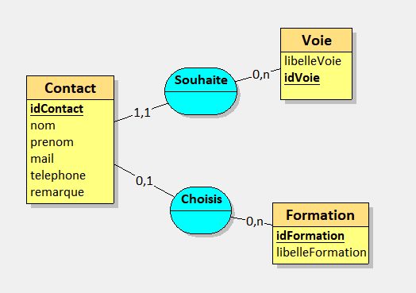

# AP Prise de contact

## Sommaire

<!-- TOC -->
* [AP Prise de contact](#ap-prise-de-contact)
  * [Analyse](#analyse)
  * [Répertoires du dépôt](#répertoires-du-dépôt)
    * [01-documents-fournis](#01-documents-fournis)
    * [02-documents-a-realiser](#02-documents-a-realiser)
    * [03-application](#03-application)
  * [Architecture](#architecture)
    * [Frontend](#frontend)
    * [Backend](#backend)
<!-- TOC -->

---

## Analyse

https://miro.com/app/board/uXjVN2-Dse0=/

---

## Répertoires du dépôt

### 01-documents-fournis

Vous y trouverez l'ensemble des documents fournis par le client.

### 02-documents-a-realiser

Modèles des documents à réaliser.

- Document de vision (votre proposition en réponse au cahier des charges fourni)
- Schémas demandés
  - Base de données

### 03-application

---

## Architecture

cf. le schéma d'architecture sur Miro
https://miro.com/app/board/uXjVN2-Dse0=/

### Frontend

### Backend